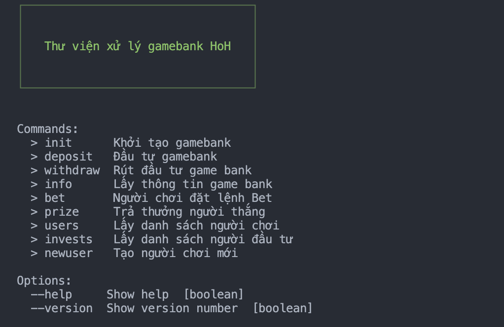

# bankroll-hoh

Bankroll for HoH

## Install

```
> npm i bankroll-hoh -g
```

or

```
> yarn global add bankroll-hoh
```

## CLI

```
> bankroll-cli ⏎
```

Chú ý: cần cài đặt redis và chạy redis server tại local.



#### Example:

##### Khởi tạo gamebank

```
> bankroll-cli init --help ⏎

Khởi tạo gamebank

Options:
      --help                       Show help  [boolean]
      --version                    Show version number  [boolean]
  -c, --currency                   Loại tokent khởi tạo
  -v, --max_invest                 Giới hạn đầu tư
  -b, --max_bet_round              Giới hạn đặt cửa của 1 round (% gamebank)
  -p, --max_profit_round           Giới hạn lợi nhuận toàn bộ người chơi trong 1 phiên
  -j, --init_jackpot               Khởi tạo Jackpot
  -n, --min_balance                Giá trị tối thiểu của gamebank. Không được rút
  -w, --warning_percent            Mức cảnh báo (chạm ngưỡng tối thiểu theo %)
  -i, --min_leverage_percent       Phần trăm tối thiểu vay đòn bẩy
  -a, --max_leverage_percent       Phần trăm tối đa vay đòn bẩy
  -l, --interest_leverage_percent  Lãi vay theo năm (%)
```

```
> bankroll-hoh % bankroll-cli init -c HoH -v 50000000 -b 0.0075 -p 0.0125 -j 3000000 -n 9000000 -w 0.3 -i 0.1 -a 0.9 -l 0.13 ⏎

==> Khởi tạo thành công gamebank
Currency: HoH
Max Invest: 50000000
Max Bet per Round(%): 0.0075
Max Profit per Round: 0.0125
Init Jackpot: 3000000
Min Gamebank balance: 9000000
Warning Gamebank balance form min(%): 0.3
Min Leverage Percent(%): 0.1
Max Leverage Percent(%): 0.9
Interest Leverage Percent(%): 0.13
Capital:
Balance:
```

#### Đầu tư gamebank

```
> bankroll-cli init --help ⏎

Đầu tư gamebank

Options:
      --help       Show help  [boolean]
      --version    Show version number  [boolean]
  -u, --user_name  Người người đầu tư
  -a, --amount     Giá trị đầu tư
```

```
> bankroll-cli deposit -u batman -a 13000000 ⏎

{
  kenny: {
    capital: 1300000,
    balance: NaN,
    create_at: 1678214033485,
    update_at: 1678247819288,
    profit_percent: NaN
  },
  batman: {
    capital: 22000000,
    balance: NaN,
    create_at: 1678214056967,
    update_at: 1678247819288,
    profit_percent: NaN
  }
}
```

## Import Project

```
import {Init, Invest, Withdraw, Bet, Prize} from 'bankroll-hoh';

const start = async () => {

    // Khởi tạo Gamebank
    const configGb = {
        currency: 'BNB',
        max_invest: 1000000,
        max_bet_round: 0.0075,
        max_profit_round: 0.0125,
        init_jackpot: 5000,
        min_balance: 15000,
        warning_percent: 0.3,
        min_leverage_percent: 0.1,
        max_leverage_percent: 0.9,
        interest_leverage_percent: 0.13
    };
    const result = await Init(configGb);

    // Đầu tư Gamebank
    Invest('batman', 500, (result) => {
        // Do something...
        console.log(result);
    })

    ......
}
```
